[](https://marketplace.visualstudio.com/items?itemName=MaikMichel.dbflow)
[](https://marketplace.visualstudio.com/items?itemName=MaikMichel.dbflow)
[](https://marketplace.visualstudio.com/items?itemName=MaikMichel.dbflow)

<p align="center">
  <br />
  <a title="Learn more adbFlux" href="#">
  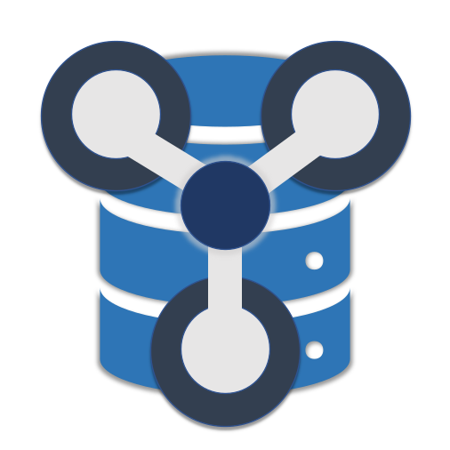
  </a>
  <h1 align="center">dbFlux<br/><span style="font-size: medium">Easy development flow for Oracle Database and APEX applications</span></h1>

</p>

**[dbFlux](https://github.com/MaikMichel/dbFlux 'Learn more about dbFlux')** is an open-source extension for [Visual Studio Code](https://code.visualstudio.com).

Using this extension enables you to develop Oracle Database and APEX applications in a simpler flow

- [**Compile**](#compile 'Jump to Compile') your PL/SQL Objects to a folder specific connection
- Compile all selected schemas
- [**Install APEX Applications**](#install-apex-application 'Jump to Install APEX Application')
- [**Export APEX Applications**](#export-apex-application 'Jump to Export APEX Application')
- [**Export REST Modules**](#export-rest-module 'Jump to Export REST Module')
- [**Export DB Schema or Object**](#export-db-schema-or-object 'Jump to Export DB Schema or Object')
- [**Upload any file to your APEX Application**](#upload-to-apex-static-applicatoin-files 'Jump to Upload to APEX Static Applicatoin Files')
  - Additionaly minify JavaScript and CSS Files
- Run utPLSQL [**UnitTests**](#unittests 'Jump to Tests') for current TestPackage or on all selected schemas
- [**Create objects**](#create-objects 'Jumpt to Create Objects')
- Automatic run snippet on new files
- [**Split or join files**](#split-and-join-files 'Jump to Split and Join Files '), when content is seperated with "-- File: "
- [**Initialize project**](#initialize-project 'Jump to Initialize project') so you can just work
- Addionaly Support for dbFlow and XCL projects
- [**Lock and unlock Files**](#lock-and-unlock-files 'Jump to Lock and unlock Files'), so you can't accidentally delete changes allready made by another person
- [**Export APEX Static Application Files**](#export-apex-static-application-files 'Jump to Export APEX Static Application Files') to static folder


## Prerequisites

- **dbFlux** is based on VSCode Tasks/Build System and uses bash commands under the hood to speek to your SQLcli (SQLPlus and/or SQLcl). So on Windows you have to use Git-Bash or similar to have a *`bash`* execuable in path available
- **dbFlux** uses *`SQLcl`* to export Oracle APEX Applications and ORDS Moduls. So you have to have sql in path availably. Optionally you have the possibility to use *`SQLPlus`* as your standard SQLcli. This has the advantage that building or compiling the files for the database is much faster than using sqlcl, because no Java VM has to be started.

## A bit of theory
### Project Configuration

**dbFlux** knows 3 types of project configurations:

| Mode       | Description
|------------|------------------------------------------------------
| **dbFLux** | In dbFLux mode, the configuration of the project is managed internally by **dbFlux** itself. For this you simply have to execute the command: `dbFlux: Initialize Project structure`. In this case the settings are internally managed by **dbFlux** via VSCode.
| **dbFLow** | In dbFLow mode, the project structure and the respective connection data are read via the dbFlow configuration files (build.env and apply.env).
| **xcl**    | In xcl mode, the project structure and the respective connection data are read via the xcl configuration files (xcl.yml and .xcl/env.env).


The Mode which dbFLux is using, will be display inside the statusbar with a little database icon in front. By Clicking on this item the configuration files will be opened or the configuration will be printed to the output panel when mode is dbFLux.

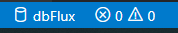


### Project Structure  [#](#project-structure 'Project Structure ')

dbFLux knows the following directories mostly at the root level of the project itself

| Folder          | Description
| --------------- | ---------------------------------------------------
| **apex**        | All APEX application will be stored in this folder
| **db**          | This folder contains the required database schemas and their objects.
| *db/_setup*       | This folder contains the required objects your application depends on. All scripts inside are called by the preferred admin account you configured (sys, admin, ...)
| **rest**        | Here the REST services / modules are stored
| **reports**     | binary files for templating purpose (see: [**Using Reports**](#using-reports 'Using Reports')) (*`dbFlux only`*)
| **static**      | In this folder the files are stored, which you upload later with the upload command to the static files of the respective application. (*`dbFlux only`*)

This structure is independent from the project-type. **dbFlux** knows 3 types of projects: SingleSchema, MultiSchema and FlexSchema

<p align="center">
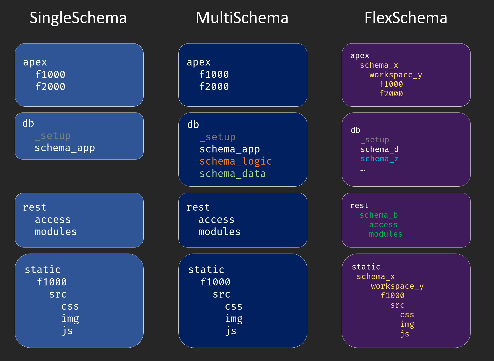
</p>

*`SingleSchema`* and *`MultiSchema`* are very similar. APEX applications and REST modules are imported or exported with the application user. The name of the workspace is stored in both modes in the project configuration. In *`MultiSchema`* mode two additional schemas (LOGIC and DATA) are used. Here a three layer model is built up, which holds the data in the DATA schema, the business logic in the LOGIC schema and everything that is application specific in the APP schema. In *`SingleSchema`* mode, a direct database connection is established with the respective schema. In *`MultiSchema`* mode, as well as in *`FlexSchema`* mode, a ProxyUser is used for the database connection, which then connects to the target schema.
If the project is configured in *`FlexMode`*, you can freely configure the corresponding schemas and workspaces via the directory structure. When using *`FlexMode`*, APEX applications are stored within workspace folders, which are again located within schema folders. The same applies to the static subdirectories, of course. REST modules are also stored in their own schema folder in *`FlexMode`*. Importing or exporting is done via the proxy user, which connects to the respective schema, which is configured by directory name.

> To make it complete: On each level of the directories there are so called `.hooks` folders. You can find them in the root directory, in the db folder and in the schema folders. The `.hooks` folders are always divided into the subfolders `pre` and `post`. During the deployment process the scripts there will be executed in alphabetically order. These type of folders are meant to hold scripts which won't change too much during lifecycle of your product. For example you could place some kind of generator script inside here (Gen TableAPI, ...).


### Schema Configuration

Each schemafolder inside **db** folder except `_setup` is build with the same structur.

| <div style="width:150px">Folder</div>| Description
|-------------------|---------------------------------------
| db                |
| .. schema         |
| .... constraints  | Constraints are stored here and subdivided according to their type
| ...... checks     | Check Constraints
| ...... foreigns   | Foreign Keys
| ...... primaries  | Primary Keys
| ...... uniques    | Unique Keys
| .... contexts     | Sys_Contexts when needed
| .... ddl          | DDL Scripts for deployment subddivided on deployment mode
| ...... init       | Init scripts are executed only for the first installation (init).
| ...... patch      | Patch scripts are executed only in the update case (patch) and are divided into scripts that are executed at the beginning or at the end of the respective update.
| ........ post     |
| ........ pre      |
| .... dml          | DML Scripts for deployment subddivided on deployment mode
| ...... base       | Base scripts are always executed, no matter if for the first installation (init) or in case of an update (patch). Therefore they must be restartable.
| ...... init       | Init scripts are executed only for the first installation (init).
| ...... patch      | Patch scripts are executed only in the update case (patch) and are divided into scripts that are executed at the beginning or at the end of the respective update.
| ........ post     |
| ........ pre      |
| .... indexes      | Indexes are stored here and subdivided according to their type
| ...... defaults   | Non uniqe indexes
| ...... primaries  | Unique Indexes based in primary key columns
| ...... uniques    | Unique Indexes
| .... jobs         | Jobs, Scheduler scripts go here
| .... policies     | Policies
| .... sequences    | Sequences must be scripted in a restartable manner
| .... sources      | All PL/SQL Code is stored in respective subfolders
| ...... functions  |
| ...... packages   | Extension for package specification is pks and extension pkb is used for body
| ...... procedures |
| ...... triggers   |
| ...... types      | Extension for type specification is tps and extension tpb is used for body
| .... views        | Views go here
| .... mviews       | Materialized Views go here
| .... tables       | Here are all create table scripts stored
| ...... tables_ddl | All table alter or modification scripts named with tablename.num.sql go here
| .....tests        | Unittests
| ...... packages   | Packages containing utPLSQL Unittests


----
## Initialize project [#](#initialize-project 'Initialize project')


To work with **dbFLux** you must either have an existing **dbFlow** or **xlc** project opened.
*BUT* sometimes you don't need CI/CD tools to support your development process. Therefore you are now able to create the desired folder structure by just triggering the command: `dbFlux: Initialize project structure`. During the initialization you will have to enter some information about the project and the database connection. Additionally you have to define the project type (see [**Project Structure**](#project-structure 'Project Structure ')). The corresponding users, as well as scripts to create the APEX workspace and initial workspace users will be created automatically by **dbFLux**. **dbFlux** collects all these scripts in the file `db/_setup/install.sql`, so you don't have to install all files manually.
> If you use FlexMode, you have to create Schemas (Command: `dbFLux: Add Schema`) and Workspace Folders (Command: Add `dbFLux: Workspace`) first. Again, **dbFlux** collects all corresponding scripts in the file `db/_setup/install.sql` where you can apply your changes in one go.


<p align="center">
  <br/>
  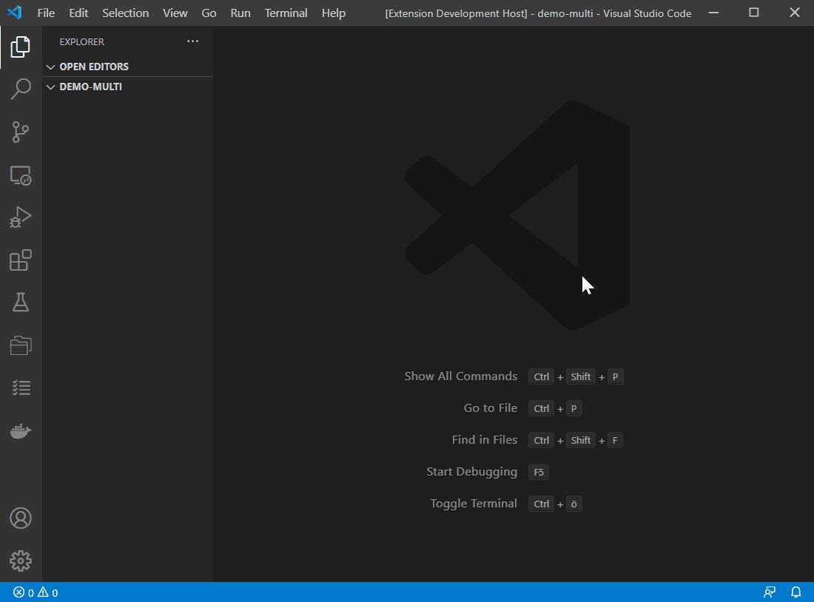
  <br/>
  <br/>
</p>


>
  >- `SingleSchema` = One Schema with workspace defined during configuration
  >- `MultiSchema` = One deployment / proxyuser and Three Schemas with one workspace defined during configuration, whereas schemas will be suffixed with _data, _logic and _app by default.
  >- `FlexSchema` = One deployment / proxyuser. You have to add Schemas and Workspaces with either the corresponding command or by placing a folder into the right level of the directory (see [**Project Structure**](#project-structure 'Project Structure '))


### Enable FlexMode

**dbFlux** can convert an existing SingleSchema or MultiSchema project into a FlexSchema with the command `dbFlux: Enable FlexMode`. This works only in one direction. The subfolders from the directories apex and static are moved into the folders, which are also created in this process: `application_schema/workspace_name`. So the folder `apex/f1000` becomes `apex/scott/scotts_ws/f1000` for example.

### Reset Password

If you have a **dbFlux** project configuration and you have not entered a password during initialization wizard steps, you will always be asked for a password per VSCode session. So you only have to enter it once. If you give an invalid password you have the ability to reset it by using command: `dbFlux: Reset password`. Once executed you will be prompted on next use.


## Compile [#](#compile 'Compile')


The main task of dbFLux is to execute, compile or deploy SQL scripts to the target database.
With **dbFlux** you can deploy SQL scripts into the database on exactly the same schema as the file you are currently working on. So if you execute the command: `dbFLux: Compile current File` *`(Ctrl+ALt+B)`* with the currently opened file "`db/**scott**/tables/emp.sql`", this file will be run against the schema **`SCOTT`**.
Files that you execute in the `db/_setup` folder are executed with the corresponding administrator account, e.g. sys or admin.
Additionally you can compile all selected schemas with the command `dbFLux: Compile selected Schemas` *`(Shift+Alt+B)`*.

By configuring the `dbFlux.customTriggerRuns` setting you have the option to specify which files to run in addition to the one you just ran. These files are then also executed according to their assigned database schema. This has the advantage that you can, for example, directly create a TableAPI whenever you run a table script.

```json
  ...
  "dbFlux.customTriggerRuns": [
      {
        "triggeringExpression": "db\/your_data\/(tables|tables/tables_ddl)\/.+\\.sql",
        "runFile": "db/your_data/.hooks/post/test_a.sql",
        "runFileParameters": ["${fileBasename}", "bbb", "ccc"]
      },
      {
        "triggeringExpression": "db\/your_data\/(tables|tables/tables_ddl)\/.+\\.sql",
        "runFile": "db/your_logic/.hooks/post/test_b.sql"
    }
  ]
  ...

```

Optionally you can pass parameter alongside to it. These parameters can use VSCode variables [https://code.visualstudio.com/docs/editor/variables-reference](https://code.visualstudio.com/docs/editor/variables-reference)


### Demo - Compile PL/SQL

<p align="center">
  <br/>
  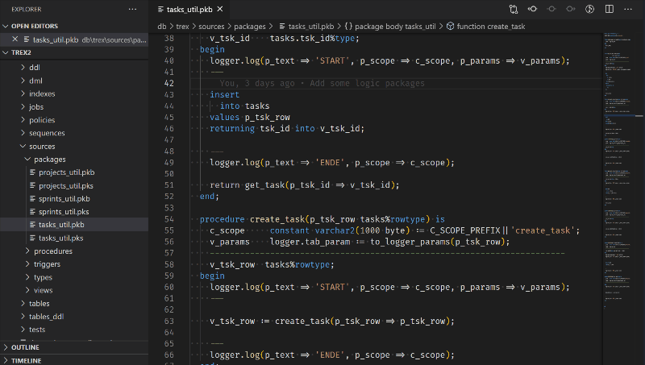
  <br/>
  <br/>
</p>


### Keybindings

Command                  | Key           | Description
-------------------------|---------------|------------------------------------------------------
Compile current File     | `ctrl+alt+b`  | Compiles the current file and marks any errors
Compile selected Schemas | `shift+alt+b` | Offers a selection window, then compiles the selected schemas and marks the invalid files


### Setting

Key                           | Description
------------------------------|--------------------------------------
dbFlux.cliToUseForCompilation | You can choose beteen SQLPlus and SQLcl. For performance reason we suggest you to go with SQLPlus. But you won't have to. Please make sure to set binaries to path
dbFlux.showWarningMessages.</br>FocusProblemPanelWhenExists | If problems occure after compiling, this panel get's the focus
dbFlux.showWarningMessages.</br>AfterCompilation | If set to true additional output concerning warning messages is rendered to output
dbFlux.showWarningMessages.</br>AfterCompilationExcludingFollowingCodes | Array of PLS Warning Codes to exclude. This is equivalent to: ALTER SESSION SET PLSQL_WARNINGS = 'ENABLE:ALL', 'DISABLE:(List,of,pls,warning,codes)';
dbFlux.showWarningMessages.</br>showWarningsAndErrorsWithColoredOutput | Enables colored output from SQL(plus/cl) output. This is for environment which does not support colored output.
dbFlux.customTriggerRuns | See above
dbFlux.extensionsWhichShouldBeHandeldBySqlCli | File-Extension **dbFlux** can compile by using either SQLPlus or SQLcl. (sql, pks, pkb, tps, tpb, prc, fnc)


## Upload to APEX Static Applicatoin Files [#](#upload-to-apex-static-applicatoin-files 'Upload to APEX Static Applicatoin Files')

**dbFlux** offers the functionality to upload JavaScript and CSS files directly into the APEX StaticFiles of the database. In addition, a minified version of each file is provided. These files can then be referenced on the corresponding page (`#APP_FILES#js/P4711_some_javascript#MIN#.js`). If you upload files from the subfolders `static/\**/src/js` or `static/\**/src/css` they will be minified and uploaded according to their file extension. Furthermore you have the possibility to upload files from other subfolders like `static/\**/src/img`. These will be treated as binary files and will not be processed further.

### Demo - Minify & Upload JS / CSS

<p align="center">
  <br/>
  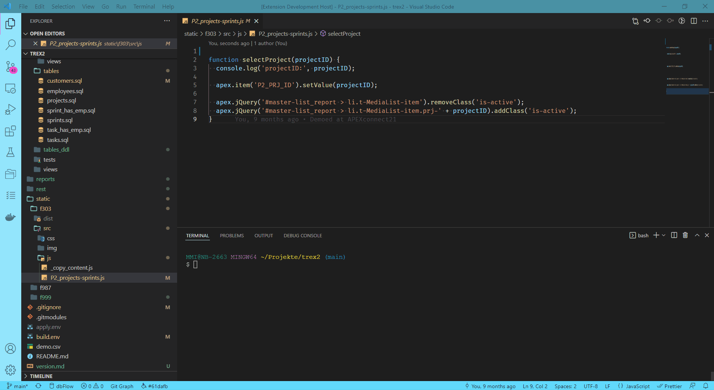
  <br/>
  <br/>
</p>

<p align="center">
  <br/>
  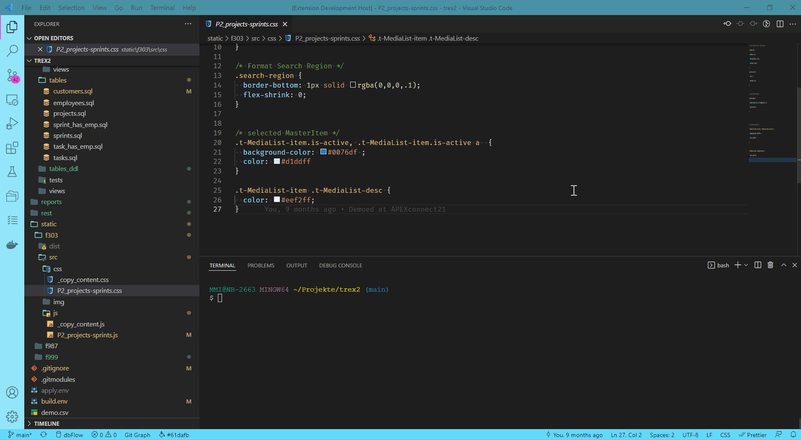
  <br/>
  <br/>
</p>


### Settings

Key                           | Description
------------------------------|--------------------------------------
dbFlux.javaScriptModification.</br>createAndUploadJavascriptMinifiedVersion | Create a minified version of your JavaScript file
dbFlux.javaScriptModification.</br>createAndUploadJavascriptSourceMap | Create a source map of your minified JavaScript file
dbFlux.javaScriptModification.</br>createAndUploadJavascriptMinifiedVersion | Create a minified version of your CSS file

### Keybindings

Command                  | Key           | Description
-------------------------|---------------|------------------------------------------------------------
Compile current File     | `ctrl+alt+b`  | Upload the current or selected file and minify if css or js


## Using Reports [#](#using-reports 'Using Reports')

If you want to upload files to a specific table or service, place them inside the reports folder/subfolder ex.: `reports/aop`. Here you have to put a template file with the name template.sql in. This template is merged into an upload file. When calling the command `dbFLux: Compile current file` you are prompted for a filename and a target directory to place the resulting file in.
By using command `dbFlux: Add REPORT Type` you are asked to give a name. Then a respective subfolder is created underneath reports mainfolder with a template.sql file inside. You have to modify this file to place the resulting blob to a row of your target table.

#### Demo - Create a report type, merge with template, move to target folder and compile

<p align="center">
  <br/>
  
  <br/>
  <br/>
</p>


### Keybindings

Command                  | Key           | Description
-------------------------|---------------|------------------------------------------------------------
Compile current File     | `ctrl+alt+b`  | Creates the merged uploadfile and place it into specified target folder


## UnitTests [#](#unittests 'UnitTests')

**dbFlux** supports the execution of unit tests with utPLSQL. There are two commands for this. With the command `Execute utPLSQL test with current Package` the currently opened package from the directory db/*/tests/packages can be explicitly tested. With the command `dbFLux: Execute utPLSQL tests` all tests of the selected schemas can be executed. Depending on the configuration (SingleSchema, MultiSchema or FlexSchema), the system connects to the relevant schema and executes the tests using utPLSQL.


### Demo - Running utPLSQL Test

<p align="center">
  <br/>
  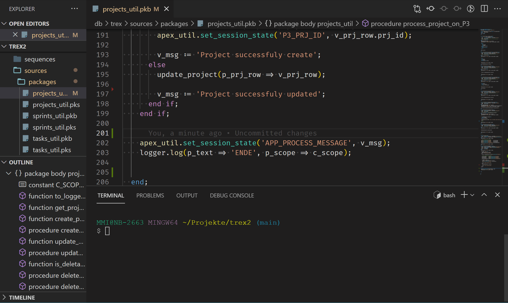
  <br/>
  <br/>
</p>


### Keybindings

Command                                   | Key                      | Description
------------------------------------------|--------------------------|---------------------------------------
Execute utPLSQL test with current Package | `alt+shift+t`            | Calls `exec ut.run(package_name);`
Execute utPLSQL tests                     | `ctrl+alt+t ctrl+alt+t`  | Calls `exec ut.run();` on selected Schemas


## Create Objects [#](#create-objects 'Create Objects')

**dbFlux** also helps you to create database objects / files. With the command: `dbFLux: Create Object` *(`Ctrl+alt+c`)* you can specify in which directory you want to create an object, and what it should be called. Afterwards this file, for packages one per specification and body, will be created. You can use VSCode's built-in fuzzy search. This allows you to enter only parts of the query. For example, to create a package in the Logic schema, you only need to enter logpack.
Furthermore **dbFlux** will try, if you have a snippet stored, to execute it directly when creating new files. It doesn't matter if the file was created with the command `dbFLux: Create Object` or by hand. If there is a snippet with the name of the respective subfolder starting from the schema folder (e.g. tables.sql or sources-packages.pks) separated by a hyphen and the corresponding extension, this will be executed. If there is no snippet stored by you, **dbFlux** will use its own snippet, if available.

### Demo - Create Object

<p align="center">
  <br/>
  
  <br/>
  <br/>
</p>

### Keybindings

Command       | Key               | Description
--------------|-------------------|---------------------------------------
Create Object | `Ctrl+alt+c`      | Choose a folder by using fuzzy-search and name object to create


- Split und Join
## Split and Join Files [#](#split-and-join-files 'Split and Join Files')

**dbFlux** focuses on the approach of the deployment framework **dbFLow**. The idea is to store all database objects in a directory separated by type. This concept becomes relevant later on when creating the deployment / the actual build. This is because in the database world, the correct order is important when deploying.
During development this can sometimes become quite a pain. Especially when you want to create a table with different indexes, primary and foreign keys and check constraints. With **dbFlux** you can write these scripts first into one file. After successful execution these components / objects can be splitted with the command `dbFLux: Split File` *`(Ctrl+alt+s`)* into the appropriate files and then checked in for example into the version management. If you want to execute all objects as a single script at a later time, you can combine them into one file with the command `dbFLux: Join Files` *`(Ctrl+alt+j)`*.
> When using this feature it is important that the line before the respective index or constraint is structured according to the following scheme: `"--File: path/to/object/inside/schema.sql"` Here is an example: `"--File: constraints/foreigns/employees_dept_fk.sql"`
**dbFlux** provides several snippets for this function, which take the typing work out of it. All these snippets can be called via dbf.tbl.*.

<p align="center">
  <br/>
  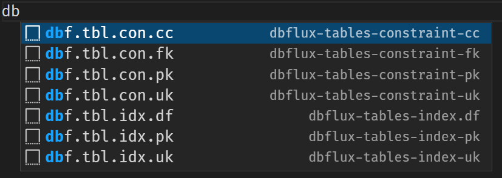
  <br/>
  <br/>
</p>


### Demo - Split and Join Files

<p align="center">
  <br/>
  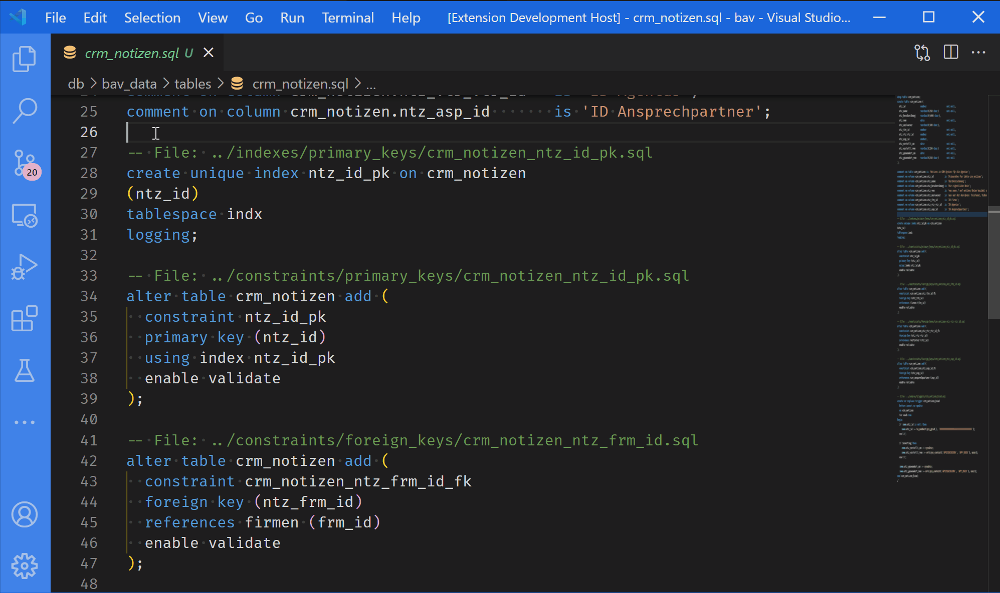
  <br/>
  <br/>
</p>

### Keybindings

Command       | Key               | Description
--------------|-------------------|---------------------------------------
Split File    | `Ctrl+alt+s`      | Split file into seperate ones by deviding file on "-- File: objecttype/file.sql
Join Files    | `Ctrl+alt+j`      | Combines all mentioned files into currentfile by reading them when tagged by ""-- File: objecttype/file.sql"


## Open Package Specification or Body

If you have just opened a package specification in the editor, you can open the corresponding body with the command `dbFLux: Open corresponding Spec/Body` *(`Ctrl+alt+o`)*. Of course, the whole thing works the other way around, too.

### Keybindings

Command                           | Key               | Description
----------------------------------|-------------------|---------------------------------------
Open corresponding Spec or Body   | `Ctrl+alt+o`      | when active file has then extension pks, then same file with extension pkb get's opened and the otherway around. This works also with types and type bodies (tps <-> tpb)


## Copy "package.method" to clipboard

When you select a method name in a package, you can copy the selection and the package name serperated with a dot to clipboard. This is very handy, if you just want to paste a method call to an APEX Process for example. Just run command: `dbFLux: Write package name.selection to ClipBoard`

### Keybindings

Command                           | Key               | Description
----------------------------------|-------------------|---------------------------------------
Write package name.selection to ClipBoard   | `Ctrl+alt+a`      | when active file extension is of: pks, pkb, tps, tpb


## Install APEX Application [#](#install-apex-application 'Install APEX Application')

With **dbFlux** you can install the exported application right back to database. You just have to call the compile command on the `apex/**/f###/install.sql`. You will be prompted to enter a target ID of the application. The default ID will be the one from the path.


## Export APEX Application [#](#export-apex-application 'Export APEX Application')

With **dbFlux** you can directly export the stored APEX applications. You just have to select an application by using command `dbFLux: Export APEX Application`. In the background APEX will then call SQLcl with the appropriate DB connection and export the application (splitted). In MultiSchema mode this is the APP schema.
> Only those applications can be exported which have been stored in the directory structure. See command: `dbFLux: Add APEX Application`.

You have the option to pass addional arguments or options to the export command of SQLcl. Just enter them in the settings.


## Export REST Module [#](#export-rest-module 'Export REST Module')

With **dbFlux** you can directly export the stored REST modules. All you have to do is to select a module by command `dbFLux: Export REST Module`. In the background APEX will then call SQLcl with the appropriate DB connection and export the module. In MultiSchema mode this is the APP schema.
> Only those modules can be exported which have been stored in the directory structure. See command: `dbFLux: Add REST Module`.

## Export DB Schema or Object [#](#export-db-schema-or-object 'Export DB Schema or Object')

**dbFlux** can export an entire schema or just a specific object. To export a schema simply call the command: ``dbFlux: Export DB Schema into Folder`` and select the schema you want to export. **dbFlux** will show you the corresponding schema folders here. Select one. Additionally you can set the destination directory. By default this is set to the schema you want to export.
If you want to export an object, you must have already created a file for it and have it currently open. If you then want to export the object with the command: ``dbFlux: Export current Object into current File`` , the object matching the file will be exported. For tables, the indexes and contraints are additionally exported.

## Export APEX Static Application Files [#](#export-apex-static-application-files 'Export APEX Static Application Files')

With **dbFLux** you can now export static application files of the configured applications to the static folder. You can either use the command: `Export Static Application Files` to export all files of an application or you can call the command: `Export Static Application File (current)` if you already have a static file open. In this case exactly this file will be downloaded from the Static Application Files. This makes it easy to start working with VSCode and dbFLux especially for existing projects.


## Add: APEX Application, REST Module, Workspace or Schema


Since the concept of **dbFlux** and dbFlow is based on a defined directory tree, **dbFlux** offers various commands to create a specific directory at the respective places and levels in this directory tree.

### Add APEX Application

So you can use the command: `dbFLux: Add APEX Application` to create a directory with the given ApplicationID at the right place in the directory. If your project is configured in SingleSchema or MultiSchema mode, the application directory will be created directly as a subfolder in the main directory `apex`. If FlexSchema mode is enabled, you will also be asked for the target schema and workspace to place the application directory exactly there.
> To add an application in FlexSchema mode, a schema and a workspace must first exist under the `apex` directory.

### Add REST Module

With the command `dbFLux: Add REST Module` you can create a directory for the correspondingly named REST module. If your project is configured in SingleSchema or MultiSchema mode, then the REST module directory will be created directly as a subfolder in the main `rest/modules` directory. If FlexSchema mode is enabled, you will also be asked for the target schema to place the module directory into.
> To add a REST module in FlexSchema mode, a schema must first exist under the `rest` directory.


### Add Workspace

In FlexSchema mode **dbFlux** additionally offers you the command `dbFLux: Add Workspace`. With this you can create a workspace in a schema directory, which must be a subfolder of the main folder `apex`. After selecting the respective schema, you only have to enter the name of the workspace and you are done. Afterwards you can create applications in this folder using the command `dbFLux: Add APEX Application`.
> In order to add a workspace in FlexSchema mode, a schema must first be available under the `apex` directory.

### Add Schema

In FlexSchema mode, dbFLux also offers you the command `dbFLux: Add Schema`. With this command you can add Schemas inside the different main directories: **`apex, db, rest, static`**. You will be shown a selection of these folders, in which you have to select all or only one, before you enter the actual schema name.


### Lock and unlock Files [#](#lock-and-unlock-files 'Lock and unlock Files')
> feature is in preview - things might change

You can enable this feature within the settings for `Rest APIEnabled`. You can find the implementation for an ORDS-REST endpoint at (https://github.com/MaikMichel/dbLock). You have to install it accordingly. It is sufficient to execute the installation file in a schema of your choice. At the end of the installation a token will be displayed. This token has to be added in addition to the URL under which this REST service is now accessible in settings as well. (`Rest APIToken`, `Rest APIUrl`)


<p align="center">
  <br/>
  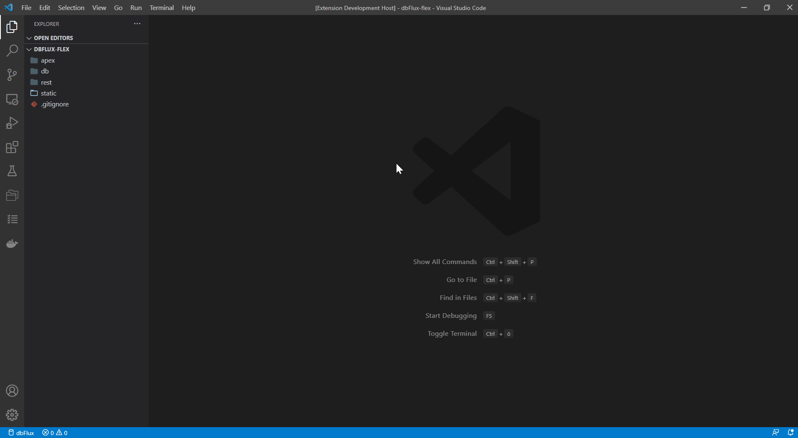
  <br/>
  <br/>
</p>


### List of all commands

| command                       | Title                                      |
| ----------------------------- | ------------------------------------------ |
| dbFlux.splitToFiles           | Split File                                 |
| dbFlux.joinFiles              | Join Files                                 |
| dbFlux.reverseBuildFromFiles  | Scan for dependent files                   |
| &nbsp; |   |
| dbFlux.createObjectWizard     | Create Object                              |
| dbFlux.createTableDDL         | Create TableDDL File                       |
| &nbsp; |   |
| dbFlux.compileFile            | Compile current File                       |
| dbFlux.compileSchemas         | Compile selected Schemas                   |
| dbFlux.executeTests           | Execute utPLSQL tests                      |
| dbFlux.executeTestPackage     | Execute utPLSQL test with current Package  |
| &nbsp; |   |
| dbFlux.exportSchema           | Export a Schema from DB into Folder        |
| dbFlux.exportObject           | Export current Object into current File    |
| dbFlux.exportAPEX             | Export APEX Application                    |
| dbFlux.exportREST             | Export REST Module                         |
| dbFlux.exportCurrentTableAsJSONDefinition | Export Table as JSON (current) |
| &nbsp; |   |
| dbFlux.addREST                | Add REST Module                            |
| dbFlux.addAPP                 | Add APEX Application                       |
| dbFlux.addWorkspace           | Add Workspace                              |
| dbFlux.addSchema              | Add Schema                                 |
| dbFlux.addStaticFolder        | Add APEX static folder                     |
| dbFlux.addReportFolder        | Add REPORT type                            |
| &nbsp; |   |
| dbFlux.openSpecOrBody         | Open corresponding Spec or Body            |
| dbFlux.copyFunctionWithPackagenameToClipBoard | Write package name.selection to ClipBoard
| dbFlux.gotoToFolder           | Goto folder                                |
| dbFlux.wrapLogSelection       | Wrap Selection with Logging Method         |
| dbFlux.wrapLogSelection.down  | Wrap Selection with Logging Method         |
| dbFlux.wrapLogSelection.up    | Wrap Selection with Logging Method         |
| &nbsp; |   |
| dbFlux.enableFlexMode         | Enable FlexMode                            |
| dbFlux.removeConfiguration    | Remove dbFlux configuration from workspace |
| dbFlux.initializeProject      | Initialize Project structure (dbFlux)               |
| dbFlux.initialize.dbFlow.Project      | Initialize Project structure (dbFlow) |
| dbFlux.resetPassword          | Reset password                             |


# Contributors or Influencers &#x1F64F;&#x2764;

A big thanks to the people that have contributed to this project or my mind
