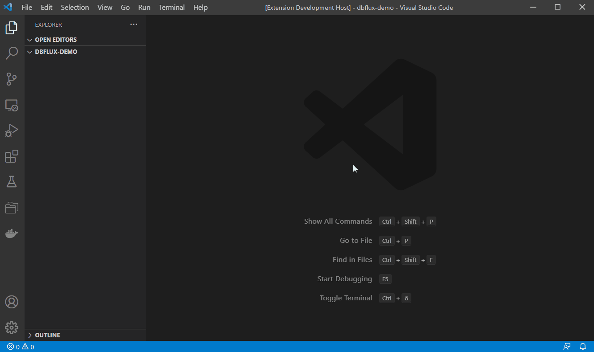
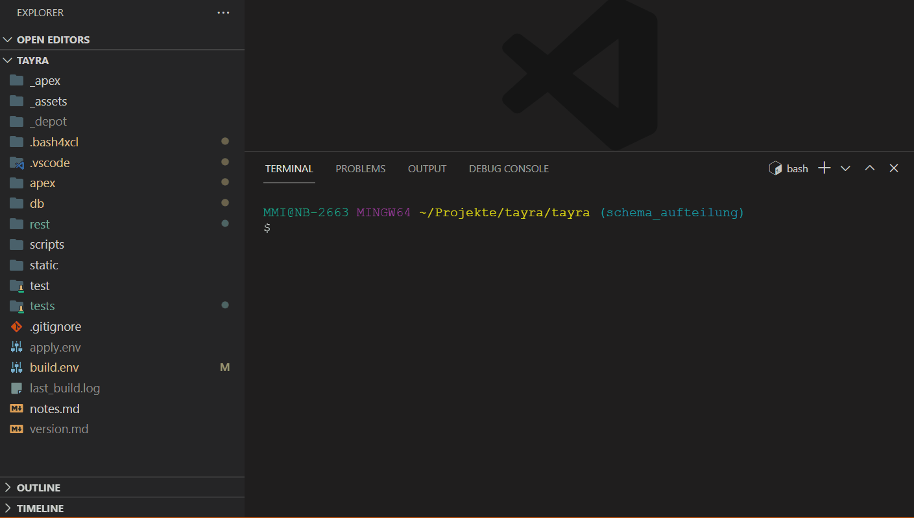

# dbFLux - Easy development flow for Oracle APEX Apps

Using this extension enables you to develop Oracle APEX applications in a simple flow

- Compile your PL/SQL Object to a folder specific connection
- Minify and upload your JavaScript Files to your APEX Application
- Minify and upload your Cascading Stylesheets to your APEX Application
- Upload any file to your APEX Application
- Run utPLSQL Test
- Runs additionaly with dbFlow and XCL configurations
- Create a project specific folder structure
- Automatic call snippet on new files
- Split or join files, when content is seperated "-- File: "

#### Demo - Compiling PL/SQL Package


#### Demo - Uploading Javascript


#### Demo - Uploading CSS


#### Demo - Running utPLSQL Tests


#### Demo - Initializing Project



#### Demo - Create an object


#### Demo - Split or join files


## Prerequisites

- Install git-bash (included when installing git)
- Install SQLcl
- SQL\*Plus [optional, but *faster* way to compile your code]


## Configuration

dbFLux Extension is based on a specic file / folder structur. Either create this structure by using command `dbFlux: Initialize project structure` or by [dbFLow-Template](https://github.com/MaikMichel/dbFLux-template) or just make it on your own.
Another way is to use XCL (coming soon)

``` shell
apex              - all your apex apps goes here
  f123            - example: app 123
db
  data_schema_name  - Database User/Schema [optional]
  logic_schema_name - Database User/Schema [optional]
  app_schema_name   - Database User/Schema
    ...             - for each object type a folder
    sources
      packages
      functions
      procedures
    tables
    views
    ...
rest
  modules
    api.abc       - exported rest module
    api.xyz       - exported rest module
static            - static application files
  f123            - example: app 123
    src
      js          - place javascript files here
      css         - place css files here

```


### Basic Workflow

#### Setup

- Open settings and choose your cli (SQL\*Plus or SQLcl)
- If you want to display addional warnings just *enable* it by checking `Show warning messages after compiliation`
- You can hide warnings by adding warning-codes to the exclusion list
- You can define custom trigger runs by defining the following array in your workspace settings
  ```json
    ...,
    "dbFLux.customTriggerRuns": [
      {
        "triggeringExpression": "db\/trex\/(tables|tables_ddl)\/.+\\.sql",
        "runFile": "db/your_data/.hooks/post/build_table_api.sql",
        "runFileParameters": ["${fileBasename}", "param2", "param3"]
      },
      {
        "triggeringExpression": "db\/trex\/(tables|tables_ddl)\/.+\\.sql",
        "runFile": "db/your_logic/.hooks/post/grant_some_rules.sql"
      }
    ]
  ```
  - Triggering expression is meant to be a regexp to match a file when building by *compile-command*
  - Whenever a file is matched all runFiles will be executed by using the connection which belongs to the specified folder
  - optionally you can pass parameter alongside to it
  - parameters can use VSCode variables [https://code.visualstudio.com/docs/editor/variables-reference](https://code.visualstudio.com/docs/editor/variables-reference)
- When enabling `Create and upload JavaScript Minified Version` your file will be minified using terser
- When enabling `Create and upload JavaScript Source Map` a source map of your JavaScript file is created and uploaded addionaly
- When enabling `Create and upload CSS minified Version` your file will be minified using uglifycss


#### Compile code

- Open file
- call command `dbFLux: Compile current file` (Ctr+Alt+B)
  - inside db-Folder
    - SQL and PL/SQL compiled towards DB connections
  - inside static-Folder
    - JSS minify, map and upload to APEX - Application Static Files
    - CSS minify, map and upload to APEX - Application Static Files
    - inside static-Folder: upload file to APEX - Application Static Files
  - inside reports-Folder
    - File is prepared for uploading and merged with given template.sql inside child folder


#### Prepare upload

If you want to upload files to a specific table or service, place them inside the reports folder/subfolder ex.: `reports/docs`. Here you have to put a template file with the name template.sql in. This template is merged into an upload file. When calling the command: `dbFLux: Compile current file` you are prompted for a filename and a target directory to place the resulting file in.

#### Demo - Create a report type, merge with template, move to target folder and compile


#### Execute utPLSQL Unittests

To run your tests just call the command: `dbFLux: Execute utPLSQL tests`. All tests found are executed. If you are using the multischema configuration you are prompted to select the schemas to run your tests.




#### Initialze project

Sometimes you don't need CI/CD tools to support your development process. Therefore you are now able to create the desired folder structure by just triggering the command: `dbFlux: Initialize project structure. Here you are prompted to enter the name and type of the project. Additionally, you have to define your connection properties.
Furthermore, you can define what admin-user you are using (system, sys, ...). All files placed inside folder `db/_setup` will be executed by using the admin-user. The password for this special connection has to be entered manually and will not be saved on disk.


#### Object creation

By running the command: `dbFlux: Create object` (Ctrl+Alt+C) you are now able to create an object in a specific folder directly. If a snippet is defined for that folder it will be applied afterward. Some simple snippets will ship with dbFlux. Snippets can always be overridden.
dbFlux will search for a snippet with a name specified by all folders sibling from schema level `db/schema/`. For example, if you want a snippet to be applied when creating a package spec `db/schema_logic/sources/packages/my_logic.pks` you have to create a snippet with the name `sources-packages.pks`. If you create a table `db/schema_data/tables/my_table.sql`, you have to give the name `tables.sql`. When no user-defined snipped could be applied, dbFlux will check if itself is shipped with a matching snippet. All snippet extensions have to be `.sql` except `.pks|.pkb` when using package spec or body.


#### Split or join files

During development sometimes it is easier to keep all DDL commands to create a table and the corresponding constraints in a single file. So you can place a special seperator in front of the script and by using command `dbFlux: Split File` (Ctrl+Alt+S) you can split these scripts to separate files. To get or join all thes files you can now just use command `dbFlux: Join Files` (Ctrl+Alt+J) to load all files into a single one. Here is a short example:

```sql
create table test (
  id number
);

-- File: ../indexes/primaries/test_id_pk.sql
create unique index test_id_pk on test
(ntz_id)
tablespace indx
logging;

-- File: ../constraints/primaries/test_id_pk.sql
alter table test add (
  constraint test_id_pk
  primary key (id)
  using index test_id_pk
  enable validate
);
```

You have to use "**-- File: ../relative/path/to/file.sql**" to set the marker for seperation.
